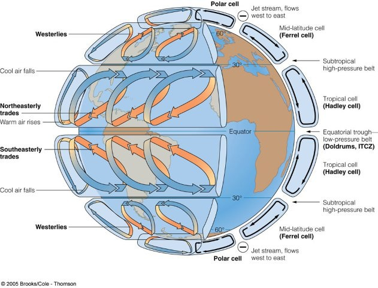
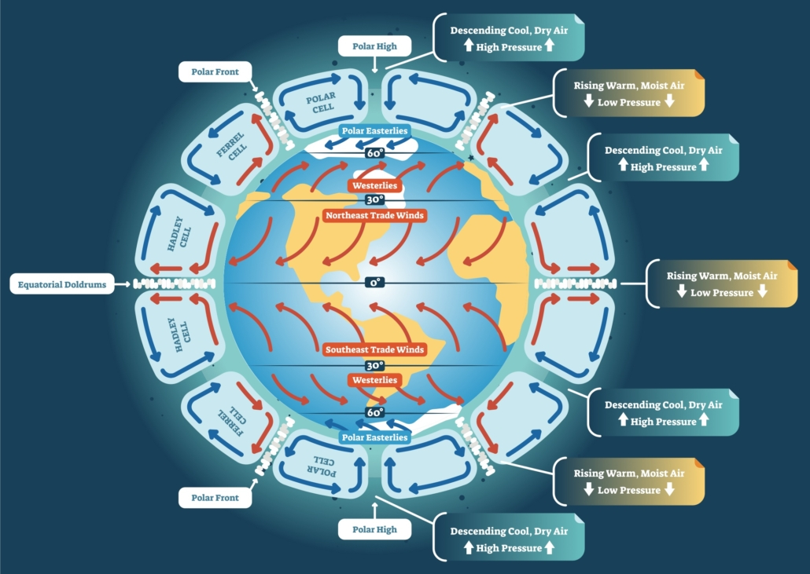

# Global Atmospheric Circulation

# 1. What Is Global Atmospheric Circulation?

**Global atmospheric circulation** refers to the large-scale, planetary-scale movement of air through the atmosphere.

Its fundamental purpose is to **redistribute heat and moisture** across the Earth.

The tropics receive more solar energy than they lose through outgoing radiation, while the higher latitudes generally lose more energy than they receive. Atmospheric circulation, together with ocean circulation, helps transfer energy from lower latitudes towards higher latitudes.

## Basic sequence

<div align="center">

<div style="border: 1px solid #888; border-radius: 6px; padding: 10px 20px; display: inline-block;">
<strong>Unequal solar heating</strong>
</div>
<br>
↓
<br>
<small>produces</small>
<br><br>
<div style="border: 1px solid #888; border-radius: 6px; padding: 10px 20px; display: inline-block;">
<strong>Temperature differences</strong>
</div>
<br>
↓
<br>
<small>which create</small>
<br><br>
<div style="border: 1px solid #888; border-radius: 6px; padding: 10px 20px; display: inline-block;">
<strong>Pressure differences</strong>
</div>
<br>
↓
<br>
<small>generate</small>
<br><br>
<div style="border: 1px solid #888; border-radius: 6px; padding: 10px 20px; display: inline-block;">
<strong>Pressure-gradient force</strong>
</div>
<br>
↓
<br>
<small>drives</small>
<br><br>
<div style="border: 1px solid #888; border-radius: 6px; padding: 10px 20px; display: inline-block;">
<strong>Large-scale movement of air</strong>
</div>
<br>
↓
<br>
<small>is modified by</small>
<br><br>
<div style="border: 1px solid #888; border-radius: 6px; padding: 10px 20px; display: inline-block;">
<strong>Coriolis deflection</strong>
</div>
<br>
↓
<br>
<small>resulting in</small>
<br><br>
<div style="border: 2px solid #555; border-radius: 8px; padding: 10px 20px; display: inline-block;">
<strong>Global wind and circulation patterns</strong>
</div>
<br><br>
</div>

Thus, global atmospheric circulation is fundamentally a consequence of the interaction between:

* **Unequal heating of Earth's surface**
* **Pressure-gradient force**
* **Earth's rotation and Coriolis effect**
* **Friction**
* **Distribution of land and oceans**

---

# 2. Why Does Earth Need Atmospheric Circulation?

Solar heating is not uniform across the Earth.

## Low latitudes

The tropics receive relatively intense solar radiation because the Sun's rays strike the surface more directly.

Therefore:

* Greater energy is received.
* The surface and lower atmosphere are strongly heated.
* Warm air tends to rise.
* Equatorial regions develop persistent rising motion and low pressure.

## High latitudes

The polar regions receive less solar energy because the Sun's rays strike the surface at a lower angle.

Therefore:

* Less energy is received per unit area.
* The surface and lower atmosphere remain relatively cold.
* Cold, dense air tends to sink.
* Polar regions develop high pressure.

This creates a large-scale **thermal imbalance between the Equator and the poles**.

**Atmospheric** and **oceanic circulation** act as a planetary heat-transfer system that reduces this imbalance.

---

# 3. Pressure-Gradient Force

Air moves primarily because of differences in atmospheric pressure.

The **pressure-gradient force (PGF)** acts from:

> **High pressure → Low pressure**

This force provides the primary driving mechanism for large-scale horizontal air movement.

However, once air begins moving, Earth's rotation causes its apparent path to be deflected by the **Coriolis effect**.

Therefore:

> **Pressure-gradient force drives the movement; Coriolis effect deflects the movement.**

Near Earth's surface, **friction** also modifies the movement of air.

---

# 4. Role of Earth's Rotation

Earth rotates from **west to east**.

Because of this rotation, moving air does not travel in a straight geographical path when viewed from Earth's rotating surface.

The apparent deflection is called the **Coriolis effect**.

### General rule

* **Northern Hemisphere → deflection to the right**
* **Southern Hemisphere → deflection to the left**

The Coriolis effect is:

* **Zero for horizontal motion at the Equator**
* **Increasing with latitude**
* **Maximum at the poles for a given speed**

It therefore plays a crucial role in determining the direction of planetary wind belts.

---

# 5. The Three-Cell Model

If the atmosphere were organised simply by differential heating between the Equator and poles, one might expect a single large circulation cell in each hemisphere.

However, Earth's rotation breaks this simple circulation into **three major cells in each hemisphere**.

Thus, the idealised model contains:

1. **Hadley Cell** — approximately 0°–30°
2. **Ferrel Cell** — approximately 30°–60°
3. **Polar Cell** — approximately 60°–90°

Therefore, there are **six cells in total**:

* Three in the Northern Hemisphere
* Three in the Southern Hemisphere

The three-cell model is an idealised representation of global atmospheric circulation.

---

# 6. Three-Cell Model — Basic Structure

<div align="centre">



</div>

This arrangement produces the major **pressure belts** and **planetary wind belts** of the idealised global circulation.

<div align="centre">



</div>

---

# 7. Major Pressure Belts

There are four major pressure belts in each hemisphere.

| Latitude | Pressure Belt        | General Character                           |
| -------- | -------------------- | ------------------------------------------- |
| 0°       | **Equatorial Low**   | Rising air, convergence, heavy rainfall     |
| ~30° N/S | **Subtropical High** | Descending air, dry and stable conditions   |
| ~60° N/S | **Subpolar Low**     | Rising air, frontal activity, precipitation |
| 90° N/S  | **Polar High**       | Cold descending air, high pressure          |

These pressure belts are not perfectly continuous around the Earth because continents, oceans and seasonal changes modify them.

---

# 8. Equatorial Low-Pressure Belt

The **Equatorial Low-Pressure Belt** occurs near the Equator.

Strong solar heating produces intense warming of the surface and lower atmosphere.

Warm, moist air rises through **convection**, producing low surface pressure.

The equatorial low-pressure zone is closely associated with the **Inter-Tropical Convergence Zone (ITCZ)**.

### Characteristics

* Low pressure
* Strong convection
* Rising air
* High humidity
* Extensive cloud development
* Frequent thunderstorms
* Heavy rainfall
* Weak surface winds in the convergence zone

The ITCZ is therefore one of the most important zones of **ascending air and tropical rainfall**.

---

# 9. Inter-Tropical Convergence Zone (ITCZ)

The **Inter-Tropical Convergence Zone (ITCZ)** is the zone where the **Northeast Trade Winds and Southeast Trade Winds converge**.

The converging air is forced to rise. The ITCZ is therefore characterised by:

* Surface wind convergence
* Rising air
* Strong convection
* High humidity
* Cloud formation
* Heavy rainfall
* Frequent thunderstorms

---

# 10. Doldrums

The **doldrums** refer to the belt of generally **light and variable surface winds near the Equatorial convergence zone**.

The region is associated with the convergence of the trade winds and strong upward motion.

### Why are winds weak?

Near the ITCZ:

* Winds from the two hemispheres converge.
* Horizontal pressure gradients may be relatively weak.
* Much of the energy goes into vertical convection rather than strong horizontal surface winds.

Therefore, sailors historically experienced periods of **calm or light winds**, giving rise to the term "doldrums."

### Doldrums vs ITCZ

These terms are related but should not be treated as exact synonyms:

* **ITCZ** → meteorological zone of convergence and rising motion.
* **Doldrums** → descriptive term for the region of generally light surface winds associated with this tropical convergence zone.

---

# 11. Hadley Cell

The **Hadley Cell** extends approximately from the Equator to 30° latitude in each hemisphere.

It is a **thermally direct circulation cell** because its circulation is fundamentally driven by differential heating.

## Northern Hemisphere Hadley Cell

1. Strong heating near the Equator warms moist air.
2. Air rises near the ITCZ.
3. Rising air reaches the upper troposphere.
4. It moves poleward aloft.
5. Coriolis deflection increasingly influences this poleward flow.
6. Air eventually descends around 30°N.
7. Descending air produces the subtropical high-pressure belt.
8. At the surface, air flows back towards the Equator.
9. Coriolis deflection produces the Northeast Trade Winds.

The same process occurs in the Southern Hemisphere, producing the Southeast Trade Winds.

Hadley cell surface winds are called trade winds because their reliable and steady direction historically allowed sailing ships to conduct global commerce and trade efficiently.

---

# 12. Subtropical High-Pressure Belt

Around **30° N and 30° S**, air descends from the upper branch of the Hadley circulation.

This produces the **subtropical high-pressure belts**.

### Characteristics

* Descending air
* High pressure
* Stable atmospheric conditions
* Weak surface winds in some areas
* Generally clear skies
* Low rainfall

Because descending air warms adiabatically and suppresses cloud formation, many major subtropical deserts occur around these latitudes.

Examples include:

* Sahara
* Arabian Desert
* Australian deserts
* Atacama
* Kalahari

However, actual desert distribution also depends on ocean currents, continentality, topography and other factors.

---

# 13. Horse Latitudes

The **horse latitudes** are the subtropical regions around **30° N and 30° S**, associated with subtropical high pressure.

They are characterised by:

* Descending air
* Weak horizontal pressure gradients in many situations
* Light and variable surface winds
* Generally dry and stable weather

The term originated from historical sailing conditions, when ships could become becalmed in these regions.

---

# 14. Trade Winds

The **Trade Winds** are the tropical easterly winds that blow from the subtropical high-pressure belts towards the Equatorial low-pressure belt.

They are part of the **Hadley circulation**.

### Northern Hemisphere

Air moves towards the Equator and is deflected to the right by the Coriolis effect.

This produces:

> **Northeast Trade Winds**

They blow generally **from the northeast towards the southwest**.

### Southern Hemisphere

Air moves towards the Equator and is deflected to the left.

This produces:

> **Southeast Trade Winds**

They blow generally **from the southeast towards the northwest**.

### Summary

| Hemisphere          | Trade Wind                |
| ------------------- | ------------------------- |
| Northern Hemisphere | **Northeast Trade Winds** |
| Southern Hemisphere | **Southeast Trade Winds** |

The trade winds are therefore an excellent example of the interaction between **pressure-gradient force and Coriolis effect**.

---

# 15. Why Are Trade Winds Easterlies?

Winds are named according to the **direction from which they come**.

Therefore:

* **Northeast Trade Winds** → come from the northeast.
* **Southeast Trade Winds** → come from the southeast.

Both have an **easterly component**, meaning their overall flow is from east towards west.

The pressure-gradient force provides the equatorward component, while Coriolis deflection gives the winds their characteristic directional component.

---

# 16. Ferrel Cell

The **Ferrel Cell** occupies approximately **30°–60° latitude** in each hemisphere.

It differs fundamentally from the Hadley and Polar cells.

### Important distinction

The:

* **Hadley Cell** is thermally direct.
* **Polar Cell** is thermally direct.
* **Ferrel Cell** is largely an **indirect, dynamically driven circulation** associated with mid-latitude weather systems.

The Ferrel circulation is therefore more variable and less idealised than the Hadley circulation.

---

# 17. Westerlies

The major surface winds associated with the Ferrel zone are the **Westerlies**.

They generally blow from the **subtropical high-pressure belt towards the subpolar low-pressure belt**.

Coriolis deflects the poleward-moving air:

* In the **Northern Hemisphere → to the right**
* In the **Southern Hemisphere → to the left**

The resulting winds have a dominant **west-to-east component**.

Therefore:

> **Westerlies = prevailing west-to-east winds of the mid-latitudes.**

The westerlies are particularly important for the movement of weather systems across the mid-latitudes.

---

# 18. Subpolar Low-Pressure Belt

Around **60° N and 60° S**, relatively warm mid-latitude air meets cold polar air.

This region is associated with the **subpolar low-pressure belt**.

Air tends to rise where contrasting air masses converge.

### Characteristics

* Low pressure
* Rising air
* Strong frontal activity
* Frequent cyclones
* Cloud formation
* Significant precipitation

The boundary between contrasting tropical/subtropical and polar air masses is associated with the **polar front**.

---

# 19. Polar Front

The **polar front** is a broad zone where relatively warm mid-latitude air interacts with much colder polar air.

It is particularly important in the development and movement of **mid-latitude weather systems**.

The strong horizontal temperature gradient along the polar front contributes to the development of strong upper-level winds and the **polar-front jet stream**.

---

# 20. Polar Cell

The **Polar Cell** extends approximately from **60° to 90°** latitude.

It is a **thermally direct circulation cell**.

### Process

1. Strong radiative cooling occurs over the polar regions.
2. Air becomes cold and dense.
3. Air sinks over the poles.
4. This produces the **polar high-pressure belt**.
5. At the surface, air flows equatorward.
6. Coriolis deflects this moving air.
7. The resulting winds are the **Polar Easterlies**.
8. Around 60°, these winds interact with warmer mid-latitude air and contribute to convergence and rising motion.

---

# 21. Polar High-Pressure Belt

At the poles, intense cooling produces cold, dense air.

The air sinks, creating **polar high pressure**.

Characteristics include:

* High pressure
* Descending air
* Very cold conditions
* Low atmospheric moisture
* Generally stable conditions

Surface air flows outward from the polar highs towards lower latitudes.

---

# 22. Polar Easterlies

The **Polar Easterlies** are cold, dry surface winds that flow from the polar high-pressure regions towards the subpolar low-pressure regions.

As the air moves equatorward, the Coriolis effect deflects it.

The resulting winds have an **easterly component**.

Thus:

> **Polar Easterlies = cold, dry easterly winds of the polar regions.**

They occur in both hemispheres.

---

# 23. Complete Planetary Wind Belts

The three major planetary wind belts in each hemisphere are:

| Latitude | Wind Belt            | General Direction |
| -------- | -------------------- | ----------------- |
| 0°–30°   | **Trade Winds**      | Easterly          |
| 30°–60°  | **Westerlies**       | Westerly          |
| 60°–90°  | **Polar Easterlies** | Easterly          |

### Northern Hemisphere

* **Northeast Trade Winds**
* **Westerlies**
* **Polar Easterlies**

### Southern Hemisphere

* **Southeast Trade Winds**
* **Westerlies**
* **Polar Easterlies**

These are the major **prevailing or planetary wind belts**.

---

# 24. Why Do Major Deserts Occur Around 30°?

The subtropical regions around 30° are dominated by descending air from the Hadley circulation.

Descending air:

* Compresses
* Warms adiabatically
* Reduces relative humidity
* Suppresses cloud formation
* Limits precipitation

Therefore, the subtropical high-pressure belts are associated with many of the world's major desert regions.

---

# 25. Why Is Rainfall High Near the Equator?

Near the Equator, strong solar heating causes intense evaporation and convection.

The trade winds converge in the ITCZ.

The converging moist air rises.

As it rises:

* Air expands.
* Air cools.
* Water vapour condenses.
* Clouds develop.
* Heavy precipitation occurs.

Therefore:

> **Equatorial convergence + rising moist air + convection = high rainfall.**

This explains the broad distribution of tropical rainforests near the Equatorial belt.

---

# 26. Doldrums and Horse Latitudes — Comparison

| Feature                | Doldrums                  | Horse Latitudes              |
| ---------------------- | ------------------------- | ---------------------------- |
| Approximate location   | Near Equator              | Around 30° N/S               |
| Pressure               | Low                       | High                         |
| Vertical motion        | Rising                    | Descending                   |
| Surface winds          | Light/variable            | Often light/variable         |
| Weather                | Hot, humid, cloudy, rainy | Dry, stable, generally clear |
| Associated circulation | ITCZ / Hadley Cell        | Subtropical high             |

### Important distinction

Both can be associated with weak surface winds, but for **different physical reasons**:

* **Doldrums → convergence and rising air near the Equator**
* **Horse latitudes → descending air and subtropical high pressure around 30°**

---

# 27. Global Heat Redistribution

Global atmospheric circulation acts as a major **heat-transfer mechanism**.

<div align="center">

<div style="border: 1px solid #888; border-radius: 6px; padding: 10px 20px; display: inline-block;">
<strong>Excess heating in low latitudes</strong>
</div>
<br>
↓
<br>
<small>creates</small>
<br><br>

<div style="border: 1px solid #888; border-radius: 6px; padding: 10px 20px; display: inline-block;">
<strong>Temperature gradient</strong>
</div>
<br>
↓
<br>
<small>leads to</small>
<br><br>

<div style="border: 1px solid #888; border-radius: 6px; padding: 10px 20px; display: inline-block;">
<strong>Pressure differences</strong>
</div>
<br>
↓
<br>
<small>generate</small>
<br><br>

<div style="border: 1px solid #888; border-radius: 6px; padding: 10px 20px; display: inline-block;">
<strong>Pressure-gradient force</strong>
</div>
<br>
↓
<br>
<small>drives</small>
<br><br>

<div style="border: 1px solid #888; border-radius: 6px; padding: 10px 20px; display: inline-block;">
<strong>Large-scale atmospheric circulation</strong>
</div>
<br><br>

<table>
<tr>
<td align="center">

<div style="border: 1px solid #888; border-radius: 6px; padding: 8px 16px;">
<strong>Warm air moves poleward</strong>
</div>

</td>

<td style="padding: 0 25px;">
<strong>↔</strong>
</td>

<td align="center">

<div style="border: 1px solid #888; border-radius: 6px; padding: 8px 16px;">
<strong>Cold air moves equatorward</strong>
</div>

</td>
</tr>
</table>

<br>
↓
<br>
<small>redistributes heat</small>
<br><br>

<div style="border: 2px solid #555; border-radius: 8px; padding: 10px 20px; display: inline-block;">
<strong>Reduction of latitudinal thermal imbalance</strong>
</div>

</div>

<br>

Ocean currents perform a complementary role.

Therefore:

> **Atmosphere + oceans = major planetary heat-redistribution system.**

---

# 28. Seasonal Migration of Pressure Belts

The pressure belts and wind belts are **not fixed permanently at exactly 0°, 30°, and 60°**.

They shift seasonally because the zone of maximum solar heating migrates north and south during the year.

The ITCZ particularly shows this seasonal migration.

### During Northern Hemisphere summer

The zone of maximum heating shifts northward.

Therefore:

* ITCZ generally shifts northward.
* Pressure belts also shift to some extent.
* The seasonal movement of these circulation systems influences monsoon development.

### During Southern Hemisphere summer

The zone of maximum heating shifts southward.

Therefore:

* ITCZ shifts southward.
* Associated pressure and wind systems also migrate southward.

---

# 29. ITCZ and Monsoons

The seasonal migration of the ITCZ is important for understanding **monsoon circulation**.

The ITCZ moves towards the hemisphere experiencing greater seasonal heating.

Over South Asia, the northward movement of the ITCZ during the Northern Hemisphere summer is associated with the development of a broad low-pressure region over the heated landmass.

This interacts with the surrounding pressure systems and contributes to the **South Asian summer monsoon circulation**.

Therefore:

> **Seasonal migration of the ITCZ is an important component of monsoon dynamics, but the monsoon cannot be explained by ITCZ migration alone.**

Other factors include:

* Differential heating of land and sea
* Seasonal pressure changes
* Tibetan Plateau heating
* Cross-equatorial flow
* Jet streams
* Ocean-atmosphere interactions
* Topography

---

# 30. Coriolis Effect and Planetary Winds

The planetary wind belts arise from the interaction of **pressure-gradient forces and Earth's rotation**.

### Trade Winds

```text
Subtropical High
       ↓
Equatorward flow
       ↓
Coriolis deflection
       ↓
Trade Winds
```

### Westerlies

```text
Subtropical High
       ↓
Poleward flow
       ↓
Coriolis deflection
       ↓
Westerlies
```

### Polar Easterlies

```text
Polar High
       ↓
Equatorward flow
       ↓
Coriolis deflection
       ↓
Polar Easterlies
```

Thus:

> **Pressure gradients provide the broad direction of movement; Coriolis deflection produces the characteristic wind direction.**

---

# 31. Cyclones and Anticyclones

Global circulation also helps establish broad zones of high and low pressure.

### Cyclone

A cyclone is a **low-pressure system**.

Air moves towards the centre.

Because of Coriolis deflection:

* **Northern Hemisphere → counterclockwise**
* **Southern Hemisphere → clockwise**

### Anticyclone

An anticyclone is a **high-pressure system**.

Air moves outward from the centre.

Because of Coriolis deflection:

* **Northern Hemisphere → clockwise**
* **Southern Hemisphere → counterclockwise**

### Memory rule

```text
LOW PRESSURE
NH → Counterclockwise
SH → Clockwise

HIGH PRESSURE
NH → Clockwise
SH → Counterclockwise
```

---

# 32. Jet Streams and Global Circulation

**Jet streams** are narrow bands of very strong winds in the upper atmosphere, particularly the upper troposphere.

They are closely related to strong horizontal temperature and pressure gradients.

Two important jet streams are:

* **Subtropical jet**
* **Polar-front jet**

The **polar-front jet** is associated with the strong temperature contrast along the polar front.

The Coriolis effect strongly influences the direction of these upper-air winds.

Therefore:

> **Temperature/pressure gradients provide the driving force, while Coriolis strongly influences the direction of jet-stream flow.**

---

# 33. Ferrel Cell — Why Is It Different?

The Ferrel Cell should not be treated as simply identical to the Hadley and Polar cells.

### Hadley Cell

* Thermally direct
* Driven primarily by tropical heating
* Strong and relatively organised

### Polar Cell

* Thermally direct
* Driven primarily by strong polar cooling
* Relatively organised

### Ferrel Cell

* **Indirect / dynamically driven**
* Associated strongly with mid-latitude cyclones and anticyclones
* More variable
* Acts as a transition zone between tropical and polar circulations

The Ferrel Cell can therefore be thought of as a **statistical or idealised representation of the net circulation produced by mid-latitude weather systems**, rather than a simple thermally driven convection cell.

---

# 34. Why Is the Three-Cell Model Only an Idealisation?

The real atmosphere is much more complicated than the three-cell model.

The idealised model assumes broad, zonally organised circulation, but actual atmospheric circulation is affected by:

* Continents and oceans
* Seasonal changes
* Mountain ranges
* Ocean currents
* Land-sea thermal contrasts
* Monsoons
* Tropical cyclones
* Mid-latitude cyclones
* Anticyclones
* Jet streams
* Atmospheric waves
* Friction

Therefore:

> **The three-cell model is a conceptual framework for understanding the broad structure of global circulation, not an exact representation of real atmospheric flow.**

This limitation is particularly important for UPSC because actual pressure and wind patterns are not perfectly continuous belts around the globe.

---

# 35. Three-Cell Model — Complete Comparison

| Feature                        | Hadley Cell      | Ferrel Cell                   | Polar Cell       |
| ------------------------------ | ---------------- | ----------------------------- | ---------------- |
| Latitude                       | ~0°–30°          | ~30°–60°                      | ~60°–90°         |
| Nature                         | Thermally direct | Indirect / dynamically driven | Thermally direct |
| Main driver                    | Tropical heating | Mid-latitude weather systems  | Polar cooling    |
| Rising air                     | Near Equator     | Near ~60°                     | Near ~60°        |
| Sinking air                    | Near ~30°        | Near ~30°                     | Near poles       |
| Surface winds                  | Trade Winds      | Westerlies                    | Polar Easterlies |
| Major pressure at sinking zone | Subtropical High | Subtropical High              | Polar High       |
| Major pressure at rising zone  | Equatorial Low   | Subpolar Low                  | Subpolar Low     |

---

# 36. Key Terms — UPSC Quick Revision

### ITCZ

**Inter-Tropical Convergence Zone** — zone where the trade winds converge and air rises, producing strong convection and heavy rainfall.

### Doldrums

Region of generally light and variable winds associated with the equatorial convergence zone.

### Subtropical High

High-pressure belt around 30° N/S associated with descending air and generally dry, stable conditions.

### Horse Latitudes

Subtropical regions around 30° N/S historically associated with weak winds and calm conditions.

### Trade Winds

Tropical easterly winds flowing from subtropical highs towards the ITCZ.

### Westerlies

Mid-latitude prevailing winds with a dominant west-to-east flow.

### Polar Easterlies

Cold, dry easterly winds flowing outward from polar highs towards subpolar low-pressure regions.

### Polar Front

Zone of strong interaction between relatively warm mid-latitude air and cold polar air.

### Hadley Cell

Tropical, thermally direct circulation cell between the Equator and approximately 30°.

### Ferrel Cell

Mid-latitude, largely indirect circulation cell between approximately 30° and 60°.

### Polar Cell

High-latitude, thermally direct circulation cell between approximately 60° and the poles.

---
